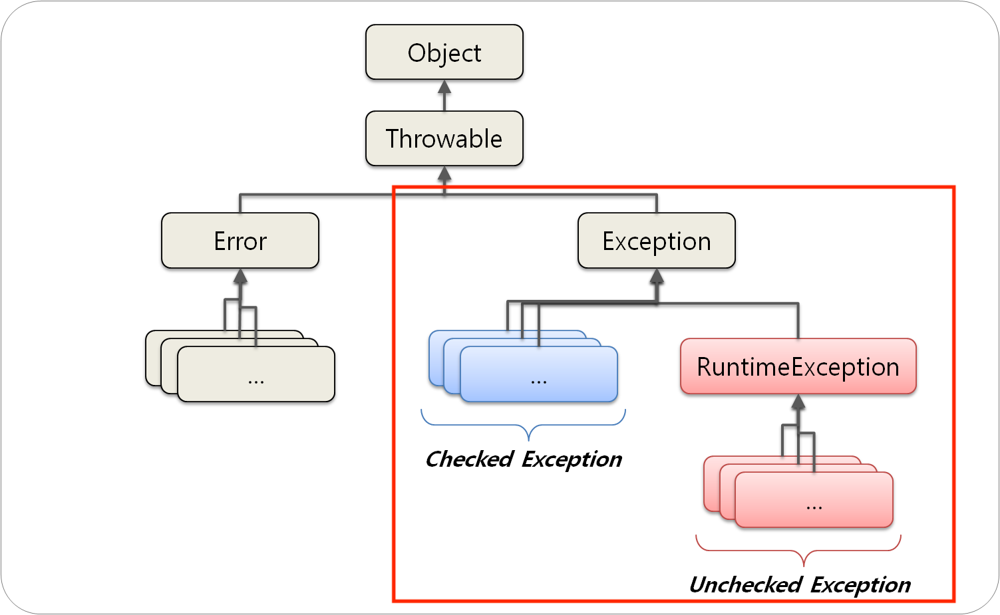

## CheckedException VS UnCheckedException

### 예외 (Exception) 란?
- 개발자가 예측 가능한 프로그램 상 오류로 예외 처리를 통해 프로그램이 종료되지 않고 정상 동작하도록 할 수 있다.
- 예외는 `RuntimeException` 상속여부에 따라 `CheckedException` 과 `UnCheckedException` 으로 구분된다.
- 대표적으로 `IOException`, `NullPointerException`, `IndexOutOfBoundException` 등이 있다.




## CheckedException
- `RuntimeException` 의 하위클래스가 아닌 모든 예외가 `CheckedException` 에 속한다.
- 컴파일 단계에서 예외처리를 확인하기 때문에 **반드시 예외처리**를 해야 한다.
- 명시적 예외처리를 통해 런타임 시점에서 발생된 예외에 대한 복구가 가능하기 때문에 기본적으로 트랜잭션이 Rollback 되지 않는다. 
- 주로 JVM 외부와 통신 시 발생한다. 
```java
/**
 * method signature 에 IOException 을 추가하여 예외처리
 * addExceptionToMethodSignature 를 호출한 상위객체에게 예외처리 위임
 */
public String addExceptionToMethodSignature(BufferedReader reader) throws IOException {
    String line = reader.readLine();
    return line;
}

/**
 * try-catch 로 감싸 예외처리
 * surroundWithTryCatch 메소드 내부에서 예외처리
 */
public String surroundWithTryCatch(BufferedReader reader) {
    try {
        String line = reader.readLine();
    } catch (IOException e) {
        e.printStackTrace();
    }
    return line;
}
```

## UnCheckedException
- `RuntimeException` 과 그 하위클래스인 예외가 `UnCheckedException` 에 속한다.
- 예외의 발생이 예측 불가능하기 때문에 컴파일 단계에서 확인하지 않는다.
- 컴파일 단계에서 예외처리가 보장되지 않기 때문에 예외 발생 시 트랜잭션이 Rollback 된다. 
```java
/**
 * NullPointerException 이 발생하도록 소스를 작성하였지만 컴파일 단계에서 예외처리를 강제하지 않음
 */
public String getUserName() {
    User user = null;
    return user.getUserName();
}
```
## Rollback 예시
### CheckedException 발생
```java
@Entity
public class User {
    @Id @GenerateValue
    private Long id;
    private String userName;
}
```

```java
@Service
public class UserService {
    @Autowired UserRepository userRepository;
    
    @Transactional
    public void save(User user) throws Exception { // CheckedException 발생으로 명시적인 예외처리 작성
        userRepository.save(user); // user 를 저장한다.
        if (user.getUserName() == null) {
            // 예시를 위해 유효성 체크를 이렇게 한다고 가정한다.
            throw new Exception("이름은 필수입니다.");  // (1) CheckedException 발생
        }
    }
}    
```
- (1) 에서 유효성 검사 후 저장된 user 를 Rollback 하기위해 Exception 을 발생시켰지만
- 실제로는 의도와는 다르게 트랜잭션이 Commit 되면서 user 는 DB에 저장된다.
- 의도한대로 동작하도록 작성하려면 아래와 같이 UnCheckedException 을 발생시켜야 트랜잭션이 Rollback 된다.

### UnCheckedException 발생
```java
@Service
public class UserService {
    @Autowired UserRepository userRepository;
    
    @Transactional
    public void save(User user) {
        userRepository.save(user); // user 를 저장한다.
        if (user.getUserName() == null) {
            // 예시를 위해 유효성 체크를 이렇게 한다고 가정한다.
            throw new RuntimeException("이름은 필수입니다.");  // UnCheckedException 발생
        }
    }
}    
```

### 트랜잭션 Rollback 범위 지정
- @Transactional 에 rollbackFor 옵션을 지정하지 않는 경우 기본적으로 스프링은 아래와 같이 설정하여 관리한다.
```java
@Transactional(rollbackFor = {RuntimeException.class, Error.class})
```
- CheckedException 도 Rollback 하려면 아래와 같이 설정하면 된다. (다만, 상황에 맞게 설정하는 것이 중요)  
```java
@Transactional(rollbackFor = {Exception.class, Error.class})
```


### 결론
- CheckedException 이 발생되는 경우 트랜잭션 Rollback 은 수행되지 않는 것을 인지해야 한다.
- 사용자 정의 Exception 을 생성하는 시점에 아래 내용을 고려해야 한다. 
  1. 예외 발생이 충분히 예측 가능하여 컴파일 단계에서 예외처리를 확인해야 한다면 Exception 클래스 상속
  2. 예외 발생 시 트랜잭션이 Rollback 되어야 한다면 RuntimeException 클래스 상속

