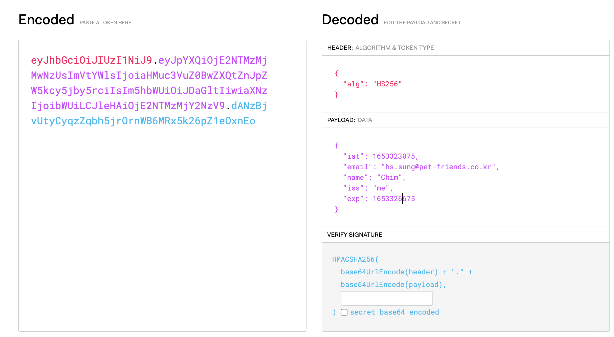

# Cookie, Session, JWT

### 배경
 
 - HTTP 는 Stateless Protocol(무상태 프로토콜)로 각 요청의 상태를 저장하지 않는다.
 - 따라서 서버는 각 요청의 상태를 알 수 없다.
 - 하지만 서비스를 개발하다보면 클라이언트의 상태를 유지할 필요가 있다.

### Cookie

 - 특징
   - 유지가 필요한 데이터를 브라우저 공간에 저장하며 요청 시 헤더에 담아 서버에 전달한다.
   - 전달 받은 데이터로 서버는 클라이언트의 정보를 확인할 수 있다.
   - key, value, 만료시간, 도메인 등을 설정

 - 단점
   - 쿠키의 값이 그대로 노출되기 때문에 보안에 취약하다.
   - 용량의 제한이 있어 많은 정보를 담기 어렵다.
   - 요청 시 모든 쿠키를 서버로 전송하기 때문에 네트워크 부하가 심해진다. 

### Session

 - 특징
   - 인증에 필요한 정보를 DB에 저장 후 생성된 세션 ID 를 브라우저로 전달하여 쿠키에 저장한다.
   - 이후 요청 시 쿠키에 저장된 세션 ID를 통해 서버는 클라이언트의 상태를 확인한다.
 - 장점
   - 보안에 민감한 정보를 서버에 저장하면서 보안이 취약한 쿠키의 단점을 보완.
   - 유출 시 세션 데이터 삭제를 통해 연결을 해제할 수 있다.
 - 단점
   - 추가적인 저장공간이 필요하므로 비용이 발생된다.
   - 요청이 들어올 때마다 인증을 위해 DB를 조회하는 로직이 동반되어야 한다.
   - 데이터베이스가 분리되는 경우엔 인증체계가 복잡해질 수 있다.

### JWT

 - 특징 
   - 인증을 위해 사용되는 암호화된 문자열
   - Header, Payload, Verify Signature 3가지 영역으로 구분
   - Header: 암호화 할 방식 or 타입을 작성
   - Payload: 인증에 사용할 정보를 작성 (암호화 되지 않기때문에 보안에 민감한 정보는 작성하면 안됨)
   - Verify Signature: Base64로 인코딩 된 Header 와 Payload 를 Secret key 로 해싱하여 암호화
   - 위 과정을 통해 AccessToken 을 발급하여 클라이언트에게 전달한다.
   
 - 장점
   - 생성된 토큰을 추적하지 않고 유효성만 판단하여 인증 로직이 간편하다. 
   - 서버에서 생성한 Header 와 Payload 로 토큰을 발급하기 때문에 위/변조를 방지할 수 있다.
   - 인증정보에 대한 별도 저장소가 필요없어 가장 stateless 한 방법
   - 토큰 기반으로 인증하는 다른 서비스와 연계가 가능하다.
 - 단점
   - 토큰 유출 시 인증을 만료시키는 것이 어렵다.
   - 토큰의 길이가 길어질수록 네트워크 부하가 심해진다.

### Session 과 JWT 중 더 좋은 것은?

 - 각 인증 방식으로 인해 제공할 수 있는 기능이 달라질 수 있다. 
 - 각각 상황에 맞는 장단점이 존재하기 때문에 "어느 것이 더 좋다"라고 단정 짓기엔 무리가 있다.
 