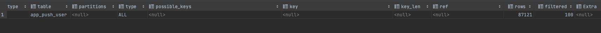
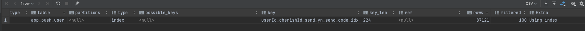

# 커버링 인덱스란?

커버링 인덱스는 쿼리의 조건을 충족시키는데 필요한 모든 데이터들을 인덱스에서만 추출할 수 있는 인덱스를 의미합니다.

커버링 인덱스는 B-Tree 인덱스를 스캔하는 것만으로도 원하는 데이터를 가져 올 수 있으며, 컬럼을 읽기 위해 디스크에 접근하여 데이터 블록을 읽지 않아도 됩니다.

인덱스는 행 전체의 크기보다 훨씬 작으며, 인덱스의 값에 따라 정렬이 되기 때문에 Sequential Read 접근이 가능해집니다.

따라서 커버링 인덱스를 활용하면 쿼리의 성능을 비약적으로 향상시킬 수 있습니다.

예시를 위해 예전 진행했던 프로젝트 내 테이블의 DDL을 가져왔습니다.

```sql
-- auto-generated definition
create table app_push_user
(
    id                  int auto_increment
        primary key,
    send_code           varchar(50)            null,
    push_date           datetime               null,
    mobile_os_type      varchar(200)           null,
    mobile_device_token varchar(200)           null,
    send_yn             varchar(2)             null,
    title               varchar(50)            null,
    message             varchar(50)            null,
    active              varchar(3) default 'Y' not null,
    CherishId           int                    null,
    UserId              int                    null,
    createdAt           datetime               not null,
    updatedAt           datetime               not null
);

create index userId_cherishId_send_yn_send_code_idx
    on app_push_user (UserId, CherishId, send_yn, send_code);
```

app_push_user 테이블에는 UserId, CherishId, send_yn, send_code가 index로 걸려 있습니다.

```sql
EXPLAIN SELECT * FROM app_push_user;
```

위 EXPLAIN 쿼리의 결과는 다음과 같습니다.



```sql
EXPLAIN SELECT UserId, CherishId, send_yn, send_code FROM app_push_user;
```

위 EXPLAIN 쿼리의 결과는 다음과 같습니다.



위 결과처럼 index에 걸려있는 값만 SELECT할 경우 Extra 란에 Using index가 나타나는 걸 볼 수 있습니다.

# 번외

## **인덱스 사용 시 주의점**

쓸데없는 인덱스를 지나치게 만드는 것은 데이터베이스 설계의 안티 패턴입니다.

쓸데없는 인덱스는 성능 개선에 효과가 없을 뿐만 아니라 분명히 악영향을 미칩니다.

인덱스 작성이 역효과 나는 예를 살펴봅시다.

### **인덱스 갱신의 오버헤드로 갱신 처리의 성능이 떨어진다**

인덱스는 테이블에 데이터가 변경되면 자동으로 인덱스 자신도 갱신하는 기능을 갖추고 있습니다.

그 대가로 인덱스가 존재하지 않는 때와 비교하면 갱신할 때마다 인덱스 갱신도 부수적으로 발생합니다.

‘은탄은 없다’라는 말이 있듯이 SELECT 절의 성능 향상을 위해 INSERT, UPDATE 절의 성능을 포기하는 것입니다.

### **의도한 것과 다른 인덱스가 사용된다**

이는 한 개의 테이블에 복수의 인덱스를 작성한 경우에 발생하는 문제입니다.

업무의 중심이 되는 테이블은 다양한 SQL 문에서 이용되며, 거기에 대응해 작성된 인덱스 수도 많아지게 됩니다.

10~20개 정도의 인덱스가 한 테이블에 만들어지는 것은 드물지는 않습니다.

느린 SQL 문에 대한 실행계획을 보면 ‘왜 이 인덱스를 사용하지?’라는 의문이 들 때도 많습니다.

이런 일이 발생하는 이유는 옵티마이저도 만능이 아니기 때문입니다.

## **인덱스를 만들 때 기준**

이는 트레이드오프가 있기 때문에 인덱스 작성은 균형을 고려해가며 실시해야 합니다.

### **[1]. 크기는 큰 테이블만 만든다**

크기가 작은 테이블에는 애초에 인덱스도 풀 스캔도 큰 차이가 없습니다.

따라서 작은 테이블은 고려 대상으로 삼을 필요가 없습니다.

### **[2]. 기본키 제약이나 유일성 제약이 부여된 열에는 불필요하다**

기본키(Primary Key) 제약이 부여된 열에는 자동으로 인덱스가 작성되어 있습니다.

또한 유일성(Unique key) 제약이 붙어 있는 열도 마찬가지입니다.

### **[3]. Cardinality가 높은 열에 만든다**

Cardinality란 값의 분산도를 나타내는 단어로, 특정 열에 대해 많은 종류의 값을 가지고 있다면, Cardinality가 높다는 의미입니다.

예를 들어, 운전면허증 번호는 운전자에게 중복되지 않게 발행되어 차를 운전할 자격이 있는 사람 수만큼의 종류가 있습니다.

Cardinality는 몇천만 정도 될 것이고, 이건 매우 Cardinality가 높은 예입니다.

Cardinality가 낮은 열에 인덱스 효과를 기대할 수 없는 것은 인덱스 트리를 따라가는 조작이 증가할수록 오버헤드가 증가해 인덱스를 작성한 혜택을 받지 못하기 때문입니다.

## **[당근마켓 면접 질문] 인덱스 hash와 B+ tree가 있는데 왜 B+ tree가 default인가요?**

모든 자료구조와 어떤 알고리즘을 비교해도 탐색 시간이 가장 빠른 해시 테이블이 아닌 B+ tree를 사용하는 이유는 단 하나의 데이터를 탐색하는 시간에만 빅오 1이기 때문입니다.

우리는 DB에서 등호뿐만 아니라 부등호도 사용할 수 있기 때문입니다.

모든 값이 정렬되어 있지 않으므로, 해시 테이블에서는 특정 기준보다 크거나 작은 값을 찾을 수 없습니다.

반면에, B-Tree는 노드 하나에 여러 데이터가 저장될 수 있습니다.

각 노드 내 데이터들은 항상 정렬된 상태이며, 데이터와 데이터 사이의 범위를 이용하여 자식 노드를 가집니다.

그러므로 자식 노드 개수는 (n+1)을 가지게 되죠.

이처럼, 위 두 개의 트리는 항상 좌, 우 자식노드 개수의 밸런스를 유지하므로 최악의 경우에도 무조건 탐색 시간이 O(logN)을 가지게 됩니다.

`(내가 정리하다 추가한 질문)` 그렇다면 RedBlack-Tree가 아닌 B+ tree가 default인 이유가 뭔가요?

이 둘의 가장 큰 차이는 '하나의 노드가 가지는 데이터 개수'입니다.

RedBlack-Tree는 무조건 하나의 노드에 하나의 데이터 요소만을, B-Tree는 하나의 노드에 여러 개의 데이터 요소를 저장합니다.

[데이터베이스 인덱스는 왜 'B-Tree'를 선택하였는가](https://helloinyong.tistory.com/296)
