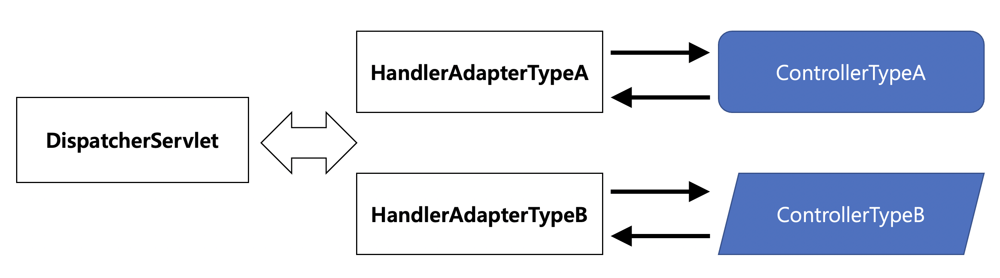

## **프론트 컨트롤러 패턴과 DispatcherServlet**

스프링이 직접 제공하는 서블릿 기반의 MVC 프레임워크입니다.

서블릿 기반이기 때문에 스프링 서블릿(Spring Servlet)라고도 불립니다.

프론트 컨트롤러 역할을 하는 DispatcherServlet을 핵심 엔진으로 사용합니다.

스프링 서블릿의 모든 컴포넌트는 스프링의 서블릿 애플리케이션 컨텍스트의 빈으로 등록되어 동작합니다.

그렇기 때문에 간단히 루트 컨텍스트에 존재하는 서비스 계층의 빈을 사용할 수 있습니다.

스프링의 웹 기술은 MVC 아키텍처를 근간으로 하고 있습니다.

MVC는 프레젠테이션 계층의 구성요소를 다음과 같이 분리하고 아래 요소가 서로 협력해서 하나의 웹 요청을 처리하고 응답을 만들어내는 구조를 이룹니다.

- M : 정보를 담은 모델(Model)
- V : 화면 출력 로직을 담은 뷰(View)
- C : 제어 로직을 담은 컨트롤러(Controller)

MVC 아키텍처는 위에서 언급한 프론트 컨트롤러 패턴과 함께 사용됩니다.

### **프론트 컨트롤러 패턴**

중앙집중형 컨트롤러를 프레젠테이션 계층의 제일 앞에 둬서 서버로 들어오는 모든 요청을 먼저 받아서 처리하게 만듭니다.

처리 과정은 다음과 같습니다.

- 요청을 받아서 공통적인 작업을 먼저 수행합니다.
- 적절한 세부 컨트롤러로 작업을 위임해줍니다.
- 클라이언트에게 보낼 뷰를 선택해서 최종 결과를 생성하는 작업을 수행합니다.

예외가 발생했을 때도 마찬가지로 프론트 컨트롤러가 처리합니다.

프론트 컨트롤러는 컨트롤러와 뷰, 그리고 그 사이에서 주고받는 모델, 세 가지를 이용해서 작업을 수행합니다.

이 프론트 컨트롤러 역할을 DispatcherServlet이 해줍니다.

### **DispatcherServlet**

MVC 아키텍처로 구성된 프레젠테이션 계층을 만들 수 있도록 설계되어 있습니다.

HTTP 요청 핸들러 혹은 컨트롤러를 위한 중앙 디스패처입니다.

웹 요청을 처리하기 위해 등록된 핸들러로 발송(dispatch)하여 매핑 및 예외 처리 기능을 제공합니다.

적절한 어댑터 클래스를 설치하여 거의 모든 워크플로우와 함께 사용할 수 있습니다.

⇒ 스프링의 원칙에도 부합하는 걸 알 수 있는 대목입니다.

## **스프링의 DispatcherServlet과 MVC의 작업 흐름**

### [1]. DispatcherServlet의 HTTP 요청 접수

자바 서버의 서블릿 컨테이너는 HTTP 프로토콜을 통해 들어오는 요청이 스프링의 DispatcherServlet에 할당된 것이라면 HTTP 요청정보를 DispatcherServlet에 전달해줍니다.

DispatcherServlet은 모든 요청에 대해 공통적으로 진행해야 하는 전처리 작업이 등록된 게 있다면 이를 먼저 수행합니다.

예시로, 보안이나 파라미터 조작, 한글 디코딩과 같은 작업이 적용됩니다.

### [2]. DispatcherServlet에서 컨트롤러로 HTTP 요청 위임

DispatcherServlet은 URL이나 파라미터 정보, HTTP 명령 등을 참고하여 어떤 컨트롤러에게 작업을 위임할지 결정합니다.

컨트롤러를 선정하는 것은 DispatcherServlet의 핸들러 매핑 전략을 이용합니다.

핸들러 매핑 전략은 사용자 요청을 기준으로 어떤 핸들러에게 작업을 위임할지를 결정해주는 것을 의미합니다.

어떤 컨트롤러/핸들러가 요청을 처리하게 할지를 결정했다면, 다음은 해당 컨트롤러 객체의 메서드를 호출해서 실제로 웹 요청을 처리하는 작업을 위임할 차례입니다.

자바의 객체 사이에 무엇인가 요청이 전달되려면 메서드가 호출돼야 하고, 그러려면 DispatcherServlet이 컨트롤러 객체의 메서드를 호출할 수 있는 방법이 있어야 합니다.

이를 해결할 방법은 어댑터를 이용하는 것입니다.

전형적인 객체 어댑터 패턴을 사용해서, 특정 컨트롤러를 호출할 때는 해당 컨트롤러 타입을 지원하는 어댑터를 중간에 껴서 호출하는 것입니다.

스프링 서블릿/MVC 확장구조의 기본은 바로 어댑터를 통한 컨트롤러 호출 방식입니다.

어떤 어댑터를 사용할지는 DispatcherServlet 전략의 하나인 핸들러 어댑터 전략을 통해 결정합니다.

DispatcherServlet이 핸들러 어댑터에 웹 요청을 전달할 때에는 모든 웹 요청 정보가 담긴 HttpServletRequest 타입의 객체를 전달해줍니다.

이를 어댑터가 변환해서 컨트롤러의 메서드가 받을 수 있는 파라미터로 변환해서 전달해줍니다.

### [3]. 컨트롤러의 모델 생성과 정보 등록

컨트롤러의 작업은 다음 4가지가 순차적으로 이루어집니다.

- 사용자 요청을 해석하는 것
- 그에 따라 실제 비즈니스 로직을 수행하도록 서비스 계층 객체에게 작업을 위임하는 것
- 결과를 받아서 모델을 생성하는 것
- 어떤 뷰를 사용할지 결정하는 것

컨트롤러가 어떤 식으로든 다시 DispatcherServlet에 돌려줘야 할 정보가 있는데, 바로 모델과 뷰입니다.

### [4]. 컨트롤러의 결과 리턴: 모델과 뷰

뷰의 논리적인 이름을 리턴해주면 DispatcherServlet의 전략인 View Resolver가 이를 이용해 뷰 객체를 생성해줍니다.

스프링에는 ModelAndView라는 객체가 있는데 이 객체가 DispatcherServlet이 최종적으로 어댑터를 통해 컨트롤러로부터 돌려받는 객체입니다.

모델과 뷰를 넘기는 것으로 컨트롤러의 책임은 끝이 납니다.

### [5, 6]. DispatcherServlet의 뷰 호출과 모델 참조

뷰 객체에게 모델을 전달해주고 클라이언트에게 돌려줄 최종 결과물을 생성해달라고 요청하는 것입니다.

뷰 작업을 통한 최종 결과물은 HttpServletResponse 객체 안에 담깁니다.

### [7]. HTTP 응답 돌려주기

DispatcherServlet은 등록된 후처리기가 있는지 확인하고, 있다면 후속 작업을 진행한 뒤 뷰가 만들어준 결과를 서블릿 컨테이너에게 돌려줍니다.

서블릿 컨테이너는 받은 정보를 HTTP 응답으로 만들어 사용자의 브라우저나 클라이언트에게 전송하고 작업을 종료합니다.

## **DispatcherServlet의 DI 가능한 전략**

DispatcherServlet과 MVC 구성요소들이 요청을 처리하는 과정에서 DI로 확장 가능한 전략이 여러 개 있습니다.

그에 대해서 한 번 알아봅시다.

### HandlerMapping

URL과 요청 정보를 기준으로 어떤 핸들러 객체(컨트롤러)를 사용할 것인지를 결정하는 로직을 담당합니다.

HandlerMapping 인터페이스를 구현해서 만들 수 있습니다.

디폴트로는 다음과 같은 것들이 있습니다.

- org.springframework.web.servlet.handler.BeanNameUrlHandlerMapping
- org.springframework.web.servlet.mvc.method.annotation.RequestMappingHandlerMapping

### HandlerAdapter

핸들러 매핑으로 선택한 컨트롤러/핸들러를 DispatchServlet이 호출할 때 사용하는 어댑터입니다.

컨트롤러의 타입에는 제한이 없으며, 호출 방법은 타입에 따라 다르기 때문에 컨트롤러를 결정헀다고 하더라도 호출 방법을 DispatcherServlet이 알 수 없습니다.

디폴트로는 다음과 같은 것들이 있습니다.

- org.springframework.web.servlet.mvc.HttpRequestHandlerAdapter
- org.springframework.web.servlet.mvc.SimpleControllerHandlerAdapter
- org.springframework.web.HttpRequestHandler
- org.springframework.web.servlet.mvc.method.annotation.RequestMappingHandlerAdapter

### HandlerExceptionResolver

예외가 발생했을 때 이를 처리하는 로직을 가지고 있습니다.

예외 처리는 개발 컨트롤러가 아닌 프론트 컨트롤러인 DispatchServlet을 통해 처리되어야 합니다.

DispatchServlet은 등록된 HandlerExceptionResolver 중에서 발생한 예외에 적합한 것을 찾아서 예외처리를 위임합니다.

디폴트로는 다음과 같은 것들이 있습니다.

- org.springframework.web.servlet.mvc.method.annotation.ExceptionHandlerExceptionResolver
- org.springframework.web.servlet.mvc.annotation.ResponseStatusExceptionResolver
- org.springframework.web.servlet.mvc.support.DefaultHandlerExceptionResolver

### ViewResolver

컨트롤러가 리턴한 뷰 이름을 참고해서 적절한 뷰 객체를 찾아주는 로직을 가진 전략 객체입니다.

디폴트로는 다음과 같은 것들이 있습니다.

- org.springframework.web.servlet.view.InternalResourceViewResolver

### LocaleResolver

지역 정보를 결정해주는 전략입니다.

디폴트로는 다음과 같은 것들이 있습니다.

- org.springframework.web.servlet.i18n.AcceptHeaderLocaleResolver

이렇게 결정된 지역정보는 애플리케이션에서 활용될 수 있습니다.

이 전략을 바꾸면 지역정보를 HTTP 헤더 대신 세션이나, URL 파라미터, 쿠키 또는 XML 설정에 직접 지정한 값 등 다양한 방식으로 결정할 수 있습니다.

### ThemeResolver

테마를 가지고 이를 변경해서 사이트를 구성할 경우 사용되는 전략입니다.

디폴트로는 다음과 같은 것들이 있습니다.

- org.springframework.web.servlet.i18n.AcceptHeaderLocaleResolver

### MultipartResolver

이름 그대로 멀티 파트를 구현하기 위해 사용되는 전략입니다.

Apache Commons FileUpload 및 Servlet 3에 대한 구현이 포함되며, 일반적으로 다음 라이브러리를 사용합니다.

- org.springframework.web.multipart.commons.CommonsMultipartResolver

MultipartResolver은 디폴트는 없습니다.

### RequestToViewNameTranslator

컨트롤러에서 뷰 이름이나 뷰 객체를 제공하지 않을 경우 URL과 같은 요청정보를 참고해서 자동으로 뷰 이름을 생성해주는 전략입니다.

디폴트로는 다음과 같은 것들이 있습니다.

- org.springframework.web.servlet.view.DefaultRequestToViewNameTranslator

지금까지 소개한 전략들은 DispatcherServlet이 직접 사용하는 것들입니다.

각 전략의 구현 방식에 따라 다시 세분화된 전략이 존재할 수 있고, 이를 이용해 기존의 전략을 더 세밀하게 제어하거나 확장할 수 있습니다.

DispatcherServlet에 적용할 전략을 선택하고 필요에 따라 확장하거나 다른 방식으로 동작하도록 설정해주는 것이 스프링 MVC를 올바르게 사용하는 방법입니다.
